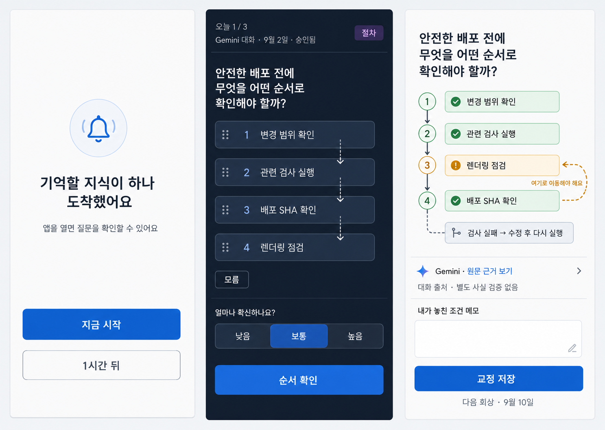

# Recall Ping Selected Wireflow

The selected direction is **Rebuild to Remember**, a mobile-first sequence that
turns a generic reminder into type-native reconstruction instead of another
passive summary or flashcard. It is the visual target for the
[Recall Ping feature specification](../../specs/features/recall-ping.md).

This image is a selected design direction, not proof of implemented or deployed
behavior. Its example uses a `procedure` bundle approved from a Gemini
conversation on September 2, 2026. Provider labels are visible only after the
authenticated app opens.

## Flow contract

| Screen | User sees | Primary action | Persistence and privacy |
| --- | --- | --- | --- |
| 1. Generic notification | A private-content-free prompt that one memory is ready, plus now and one-hour-later choices. | Start the recall flow or snooze that delivery once. | The payload contains no topic, type, question, answer, provider, source locator, item ID, or user text. The explicit snooze is idempotent and cannot chain or cross a milestone boundary. |
| 2. Reconstruction | The central question, provider/date/approval summary, type marker, sortable procedure steps, `I don't know`, and confidence. | Check the reconstructed order. | The authenticated summary contains no answer or source locator. Free text and ordering stay transient; only allowed attempt metadata may persist. |
| 3. Correction | The current approved order, a missed branch or condition, revision-scoped conversation provenance, verification status, optional memory cue, and next due date. | Save the self-assessment, optional cue, and schedule. | A cue is saved only by explicit action and stays separate from canonical knowledge, evidence, provenance, and the graph. |

The visible flow is linear:

1. Notify without content.
2. Authenticate and fetch the current eligible item.
3. Reconstruct before reveal.
4. Choose confidence.
5. Reveal the approved structure and source context.
6. Mark remembered, partial, or missed; optionally save a private memory cue.
7. Confirm the next shared Practice due time.

## Type adaptations

The middle and correction screens change their learning surface without changing
the surrounding journey.

| Type | Reconstruction surface | Correction surface |
| --- | --- | --- |
| `concept` | A small unlabeled outline for definition, key points, example, and misconception; the user recalls into fields or a single text alternative. | The approved outline appears with explicit remembered/partial/missed markers for each field. |
| `procedure` | A directional sequence whose step titles can be reordered, followed by branch, failure, and completion prompts. | The canonical flow is revealed with moved steps and omitted conditions called out by icon, label, and color. |
| `comparison` | One criterion row is hidden across the approved targets and restored by text or selection. | The complete comparison matrix and choice guide appear with differences labeled, not merely color-coded. |

The product must never imply that a card-internal sequence, comparison, or
concept outline is a causal or prerequisite Knowledge Map edge.

## Visual and interaction rules

- Preserve Girapphe's light slate canvas, white surfaces, deep-slate recall
  surface, blue/cyan active controls, amber correction, emerald confirmation,
  violet type marker, system sans typography, and restrained elevation.
- Keep one primary action per screen. Source details, scheduling, and secondary
  controls remain visually subordinate to recall.
- Use a full-height focused surface rather than nesting the entire experience in
  another card. The reconstruction itself is the hero interaction.
- Show no streak, score, leaderboard, punitive overdue count, decorative graph,
  or generated motivational copy.
- Keep private content out of the notification and show provider/provenance only
  after authentication.
- A provider/date/approval summary may appear before reveal after
  authentication; selectors, source links, verification status, and the
  approved answer remain hidden until correction.
- Bind provenance to the revision it supports. If the owner changed the current
  content afterward, label it `Edited after this conversation` instead of
  presenting the provider as support for the edited version.
- Label conversation provenance and independent fact verification separately.
- Preserve the existing selection, pending review, edit/resolve, and approval
  journey; Recall Ping starts only from approved knowledge.

## Accessibility and responsive behavior

- Every target is at least 44 by 44 logical pixels and remains usable at large
  text sizes without clipping the question or primary action.
- Procedure ordering supports explicit Move up and Move down controls, keyboard
  input, and screen-reader announcements such as "Step 2 of 4"; dragging is an
  enhancement, never the only control.
- Correct, misplaced, missing, and future states use text and icon/shape in
  addition to color. Focus order follows question, activity, `I don't know`,
  confidence, then primary action.
- Motion is optional and respects reduced-motion settings. Reordering must not
  rely on animation to communicate the result.
- The selected target is a 390 by 844 mobile surface. A later web adapter may
  reuse the same sequence in the existing narrow Practice column, but this
  wireflow does not authorize a separate desktop information architecture.
- All visible copy must use the existing localization catalogs. Long localized
  provider, date, and question strings wrap instead of truncating essential
  meaning.

## Required edge states

- Notification permission denied or later revoked.
- No eligible item when the app opens.
- Session item revised, archived, deleted, or superseded before reveal.
- Signed-out or wrong-account deep-link open.
- Offline or authenticated fetch failure, without cached private disclosure.
- Notification snoozed, opened twice, or completed from another device.
- Bundle fields insufficient for native reconstruction, triggering the central-
  question text fallback.

The edge states use generic recovery copy and return to the authoritative due
queue. None may mark an item remembered or advance its interval implicitly.

## Handoff

The behavioral and privacy requirements live in the
[feature specification](../../specs/features/recall-ping.md). Recruitment,
timing, measures, and decision thresholds live in the
[seven-day pilot plan](../operations/recall-ping-pilot.md).
